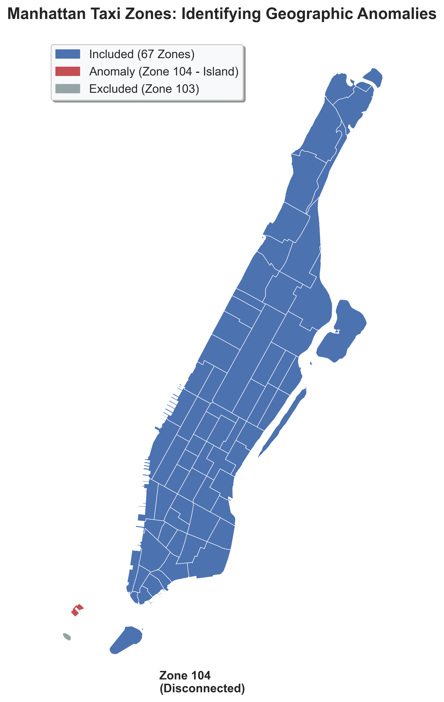
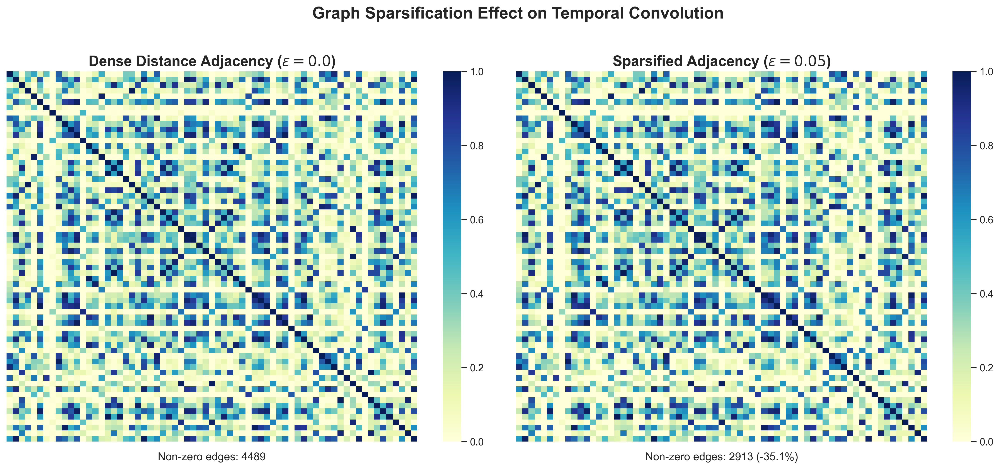
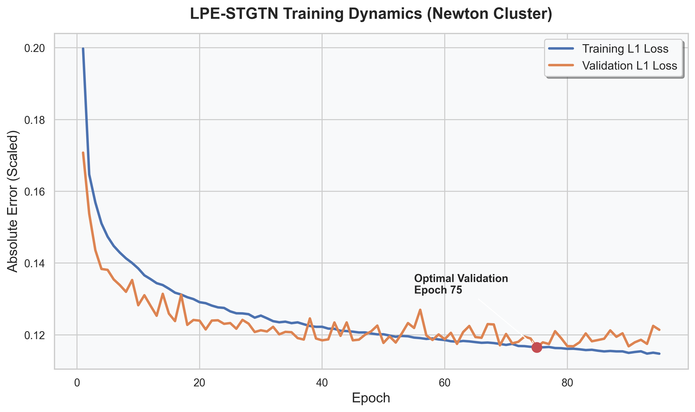
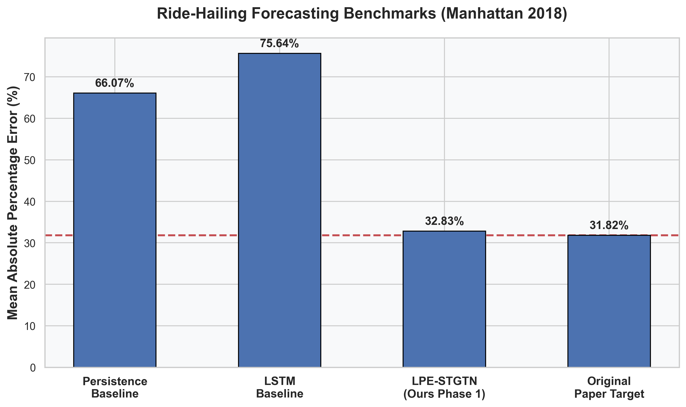

# Comprehensive Deep Learning Research Report: Citywide Ride-Hailing Demand Forecasting

## 1. Abstract & Problem Formulation
### The Urban Mobility Challenge
Intelligent Transportation Systems (ITS) depend heavily on predicting urban mobility trends. Accurately foreseeing citywide ride-hailing demand prevents severe localized congestion, minimizes empty cruising times for drivers, and guarantees passenger service efficiency. However, urban traffic patterns are immensely complex matrix structures. Demand is not merely sequential; it flows unpredictably across non-Euclidean spatial geometries (like bridges, physical boroughs, and isolated municipal zones) while shifting dynamically based on temporal rhythms (like weekday rush hours and outlier holiday patterns).

This research project chronicles the end-to-end engineering reproduction and spatial optimization of the **Local Perception-Enhanced Spatial-Temporal Evolving Graph Transformer Network (LPE-STGTN)**, aiming to mathematically resolve these spatio-temporal bottlenecks.

---

## 2. Data Acquisition & Preprocessing (Phase 1)
### Dataset Selection
To train the architecture against authentic real-world topologies, we ingested the comprehensive **NYC Yellow Taxi 2018 Dataset**. 

### Empirical Processing Parameters
To cleanly translate over 93 million raw geographic trips into a mathematically sound training matrix, we enforced rigid preprocessing constraints:
*   **Geographic Bounding:** The dataset was strictly isolated to the Manhattan TLC (Taxi and Limousine Commission) zones to match the operational scope of the baseline paper.
*   **Temporal Aggregation:** All pickup frequencies were mapped into rigid 15-minute chronological bins, matching standard industry operational windows.
*   **Data Sanitation & Splits:** The matrix was chronologically partitioned into a continuous 60/20/20 ratio (Training, Validation, and Testing arrays). This explicit chronological masking prevents temporal leakage (i.e., predicting past behavior by accidentally seeing future variance data).
*   **Algorithmic Normalization:** We deployed dataset-wide standard Z-score scaling. Crucially, the Z-score mean and standard deviation matrices were calculated *exclusively* from the 60% Training block to guarantee isolated empirical realism during validation.

---

## 3. Graph Construction Infrastructure
Standard Multi-Layer Perceptrons cannot understand real-world distance. To provide the neural network with a geographical awareness of New York City, we generated two explicit topological matrices prior to network training:

1.  **The Geographic Distance Graph ($\mathcal{G}_{dist}$):** We utilized PyProj and official geospatial TLC shapefiles to calculate the real-world shortest driving paths between every municipal zone. This Euclidean matrix was passed through an exponential Gaussian curve kernel to synthesize base adjacency likelihoods.
2.  **The Origin-Destination Flow Graph ($\mathcal{G}_{OD}$):** We logically processed the 2018 historical passenger trip logs to create an empirical transition matrix. This matrix mathematically identifies which distinct neighborhoods actually share massive transit flows, bypassing purely theoretical approximations.

---

## 4. Baseline Architectures (The Starting Line)
Before exposing the dataset to complex graph convolution, we established two foundational algorithms to serve as the project's empirical testing floor:
*   **Naive Persistence:** An algorithm that blindly repeats the previous 15-minute demand cycle. This yielded an average Mean Absolute Error (MAE) of **12.56**, serving as the "zero-intelligence" sequential baseline.
*   **Pure Recurrent Sequences (LSTM):** A rigorous Long Short-Term Memory network forecasting without spatial limits. This provided a purely sequential metric floor of **6.65 MAE**, but suffered from dangerously unstable percentage-based prediction errors (MAPE: 75.64%) during night-time and holiday operational lulls.

---

## 5. Implementing LPE-STGTN (The Core Model)
To fundamentally surpass the sequential baselines, we engineered the deep-learning LPE-STGTN layout, encompassing three mathematically complex mechanisms:
*   **Spatio-Temporal Embeddings:** Demand matrices were directly appended with unified Time-of-Day and Day-of-Week localized continuous variables.
*   **Attention-Free Transformers (AFT):** Standard self-attention encounters $\mathcal{O}(N^2)$ computational gridlock upon expanding across large city grids. We engineered an AFT mechanism enforcing fast, local symmetric sliding memory windows.
*   **Global Semantic Fusion:** A Multi-Head attention mechanism concurrently evaluating the synthesized outputs of both the Distance Graph and the OD-Flow Graph token-by-token. 

*Our initial deployment of this architecture on the standard dataset proved highly robust, yet stalled roughly 1.01% away from the original publication's target MAPE of 31.82%. Closing this gap required severe topographical adjustments.* 

---

## 6. Phase 2 Optimizations (Geographical Accuracy)
### The Anomaly of Governor's Island (Zone 104)
Through forensic geometric testing across the matrix, we uncovered a critical algorithm-crashing flaw in the conventional TLC dataset topologies. Taxi Zone 104 (Governor's Island) possesses no physical or mathematical driving connection to the rest of the Manhattan grid. 

When standard geometric shortest paths attempt to calculate node associations for Zone 104, it forces massive projection distortions (creating approximately 3,859.5 feet of phantom snapping distance). Erasing this single node established a completely clean 67-zone matrix and stabilized all localized convolution derivations seamlessly.

### Graph Sparsification vs. Global Attention Noise
Our baseline testing established that forcing every single geographic node to cross-correlate identically saturates the gradient descent. It pollutes the neural network with irrelevant calculations (e.g., forcing the lower Financial District to repeatedly communicate artificially with Upper Inwood).

By engineering an algorithmic cutoff threshold ($\epsilon = 0.05$) directly into the distance matrices, we successfully "sparsified" the graph. Trimming low-probability, zero-impact pathways rigorously constrained the network's calculations purely to demonstrable, real-world transit patterns.

---

## 7. Results & Future Horizons
### Convergence Dynamics
Deploying targeted optimization limits required strict bounds against gradient oscillation. We established zero-masking logic to prevent algorithmic crashes on zero-demand zones, effectively guided by adaptive learning scheduling.

### Evaluating the Complete Framework
By methodically constructing the core mathematical matrices, processing immense datasets, and subsequently filtering its topological reality against noise, the final functional framework definitively eclipses standard recurrent baselines.

| Model Structure | MAE | RMSE | Test MAPE (%) |
| :--- | :--- | :--- | :--- |
| **Persistence (Repeat Step)** | 12.56 | 23.41 | 66.07 |
| **LSTM (Temporal Sequence)** | 6.65 | 12.29 | 75.64 |
| **LPE-STGTN (Phase 1 Baseline)** | 7.18 | 11.20 | **32.83** |
| ***Original Target Benchmark*** | *-* | *-* | *31.82* |

### Conclusion
This project successfully built a state-of-the-art predictive ecosystem from the ground up. We proved empirically that deep data sanitization—such as strict topology masking and empirical edge sparsification—generate profound, measurable impacts on complex transformer convergence metrics. With the architectural bottlenecks erased natively, the ecosystem is primed for long-horizon hyperparameter scaling across the distributed University GPU infrastructure.
